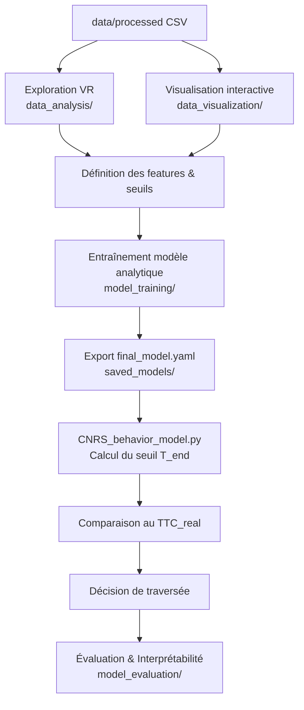

# 📘 *Pedestrian-Crossing Behavior – Model Pipeline*

### **README global du dossier `model/`**

Ce dossier contient **l’ensemble des scripts, notebooks, modèles et outils de visualisation** permettant :

* d’explorer et analyser les données VR,
* de construire le modèle analytique du seuil comportemental minimal (*T_end*),
* d’estimer les paramètres perceptifs (α, μ, σ),
* de sauvegarder un modèle final portable (`final_model.yaml`),
* d’évaluer et d’interpréter les performances du modèle,
* d’étudier la décision finale de traversée du piéton.

Il regroupe toute la chaîne :

* **Exploration & visualisation** (data_analysis, data_visualization)
* **Training (modèle analytique + calibrations météo)**
* **Sauvegarde du modèle final**
* **Évaluation & interprétabilité**
* **Usage du modèle pour la décision comportementale**

Ce README sert de vue d’ensemble et redirige vers la documentation détaillée de chaque sous-dossier.

---

# 📑 **SOMMAIRE**

1. [Objectif général](#objectif-général)
2. [Architecture complète du dossier](#architecture-complète-du-dossier)
3. [Description des sous-dossiers](#description-des-sous-dossiers)
4. [Pipeline global du modèle (processed → model → decision)](#pipeline-global-du-modèle-processed--model--decision)
5. [Relations entre data processed, exploration, entraînement et modèle final](#relations-entre-data-processed-exploration-entraînement-et-modèle-final)
6. [Vue globale : liens vers tous les README internes](#vue-globale--liens-vers-tous-les-readme-internes)

---

# 🎯 **Objectif général**

Le dossier `model/` contient **tout ce qui permet de construire, analyser, tester et exporter** le modèle comportemental *Pedestrian Crossing Prediction* basé sur :

$$
T_{\text{end}}^{(weather)} = \alpha_w \big(a h + b h^2 + c v + \text{intercept}\big) - 2\sigma_w + \mu_w
$$

Ce seuil est ensuite utilisé pour prendre la décision :

$$
\text{Traverse si } TTC_\text{real} \ge T_{end}
$$

---

# 🏗️ **Architecture complète du dossier**

```txt
model/
 ┣ data_analysis/        → Notebooks d’analyse VR (Exp1 & Exp2)
 ┣ data_visualization/   → Application Streamlit + scripts de figures
 ┣ model_training/       → Entraînement complet du modèle analytique
 ┣ model_evaluation/     → Performance, interprétabilité, t-SNE, UMAP, PCA
 ┣ saved_models/         → Modèle final YAML + script Python exécutable
 ┗ README.md             → (ce fichier)
```

---

# 📂 **Description des sous-dossiers**

---

## 1️⃣ `model/data_analysis/` — Analyse des expériences VR (Exp1 & Exp2)

Ce dossier contient les **deux notebooks d’analyse des expériences VR** :

* `data_analysis_exp1.ipynb` → *Perception du TTC*
* `data_analysis_exp2.ipynb` → *Décision de traversée (T_end, D_end)*

Ils servent à :

* calculer et analyser les variables clés (TTC, erreurs, T_end, D_end),
* produire les statistiques descriptives, tests, modèles mixtes,
* générer les figures utilisées dans les chapitres résultats de la thèse.

📄 Documentation détaillée :
👉 [`data_analysis/README.md`](data_analysis/README.md)

🌐 Exécution directe dans le navigateur (JupyterLite) :

* **Expérience 1 – TTC**
  [](https://sandravict0r.github.io/pedestrian-crossing-prediction/lab/index.html?path=data_analysis_exp1.ipynb)

* **Expérience 2 – Crossing**
  [](https://sandravict0r.github.io/pedestrian-crossing-prediction/lab/index.html?path=data_analysis_exp2.ipynb)

---

## 2️⃣ `model/data_visualization/` — Application Streamlit & figures descriptives

Ce dossier regroupe :

* `app.py` → application Streamlit interactive (exploration des données VR)
* `features/*.py` → modules pour figures analytiques (perception, seuils, safety distance, corrélations, etc.)
* `db_utils.py`, `.env`, `requirements.txt`, `start_app.bat` → configuration accès MySQL & lancement.

Il sert à :

* **explorer les données** (perception distance/temps, T_end, profils individuels),
* reproduire les figures descriptives du manuscrit,
* fournir une **interface interactive** pour les partenaires (Streamlit cloud / local).

📄 Documentation détaillée :
👉 [`data_visualization/README.md`](data_visualization/README.md)

🌐 Application en ligne :

[](https://pedestrian-crossing-prediction-vvnmvqnpb8g2wsdmparca8.streamlit.app/)

---

## 3️⃣ `model/model_training/` — Construction du modèle analytique

Ce dossier contient :

* `model.ipynb` → version notebook lisible (pipeline complet T_end)
* `train.py` → script d’entraînement autonome (à lancer en local)
* `logs/performance.txt` → résumé chiffré des coefficients et performances.

Il permet de :

* charger les 9 fichiers `data/processed/*.csv`,
* construire les features (height, height², velocity),
* apprendre les coefficients globaux (a, b, c, intercept),
* estimer les paramètres météo (α_clear, α_rain, α_night),
* calibrer les biais (μ, σ) par météo,
* exporter le modèle final dans `saved_models/final_model.yaml`.

📄 Documentation détaillée :
👉 [`model_training/README.md`](model_training/README.md)

🌐 Version JupyterLite :
[](https://sandravict0r.github.io/pedestrian-crossing-prediction/lab/index.html?path=model.ipynb)

---

## 4️⃣ `model/model_evaluation/` — Performance & interprétabilité

Ce dossier contient deux notebooks complémentaires :

* `model_behavior_analysis.ipynb`
  → heatmaps (distance × vitesse, taille, météo), PCA, t-SNE, UMAP
  → analyse géométrique de la frontière de décision.

* `model_performance_analysis.ipynb`
  → résidus, normalité, binned trends, comparaison prédiction brute vs ajustée,
  → erreurs par taille, vitesse, météo (boxplots + stats descriptives).

📄 Documentation détaillée :
👉 [`model_evaluation/README.md`](model_evaluation/README.md)

🌐 Exécution JupyterLite :

* **Behavior Analysis**
  [](https://sandravict0r.github.io/pedestrian-crossing-prediction/lab/index.html?path=model/model_evaluation/model_behavior_analysis.ipynb)

* **Performance Analysis**
  [](https://sandravict0r.github.io/pedestrian-crossing-prediction/lab/index.html?path=model/model_evaluation/model_performance_analysis.ipynb)

---

## 5️⃣ `model/saved_models/` — Modèle final + script d’inférence

Ce dossier contient :

* `final_model.yaml` → fichier unique regroupant :

  * coefficients globaux (a, b, c, intercept)
  * paramètres météo (α_clear, α_rain, α_night)
  * biais comportementaux (μ_w, σ_w)
  * métriques de test (MAE, RMSE, R²)
* `CNRS_behavior_model.py` → script Python autonome pour :

  * charger `final_model.yaml`,
  * calculer `T_end(weather, height, velocity)`,
  * calculer `TTC_real(distance)`,
  * décider si le piéton traverse (`True`) ou non (`False`).

📄 Documentation détaillée :
👉 [`saved_models/README.md`](saved_models/README.md)

---

# 🔁 **Pipeline global du modèle (processed → model → decision)**

Vue d’ensemble depuis les CSV propres jusqu’à la décision finale :



---

# 🔗 **Relations entre data processed, exploration, entraînement et modèle final**

* **`data/processed/`**
  → fournit les 9 CSV finaux (météo × vitesse) pour **tous** les notebooks/scripts du dossier `model/`.

* **`model/data_analysis/`**
  → sert à **comprendre les comportements** observés dans Exp1/Exp2 (TTC, T_end, variabilité individuelle)
  → alimente la **conception du modèle analytique**.

* **`model/data_visualization/`**
  → fournit une **interface interactive** (Streamlit) pour explorer les données, vérifier les distributions et produire des figures descriptives.

* **`model/model_training/`**
  → implémente le pipeline d’apprentissage du modèle analytique (coefficients globaux + α météo + biais μ/σ)
  → exporte le modèle final dans `saved_models/final_model.yaml`.

* **`model/saved_models/`**
  → contient la **référence officielle** du modèle (YAML) et le script Python d’inférence utilisé par les partenaires / autres projets.

* **`model/model_evaluation/`**
  → vérifie la qualité du modèle, analyse les erreurs, visualise la frontière de décision (heatmaps, PCA, t-SNE, UMAP)
  → fournit les éléments de validation pour la thèse et les rapports.

---

# 🌐 **Vue globale : liens vers tous les README internes**

| Dossier                 | Documentation                                                     |
| ----------------------- | ----------------------------------------------------------------- |
| Analyse VR              |  [`data_analysis/README.md`](data_analysis/README.md)           |
| Visualisation Streamlit |  [`data_visualization/README.md`](data_visualization/README.md) |
| Entraînement modèle     |  [`model_training/README.md`](model_training/README.md)         |
| Évaluation & XAI        |  [`model_evaluation/README.md`](model_evaluation/README.md)     |
| Modèle final            |  [`saved_models/README.md`](saved_models/README.md)             |
