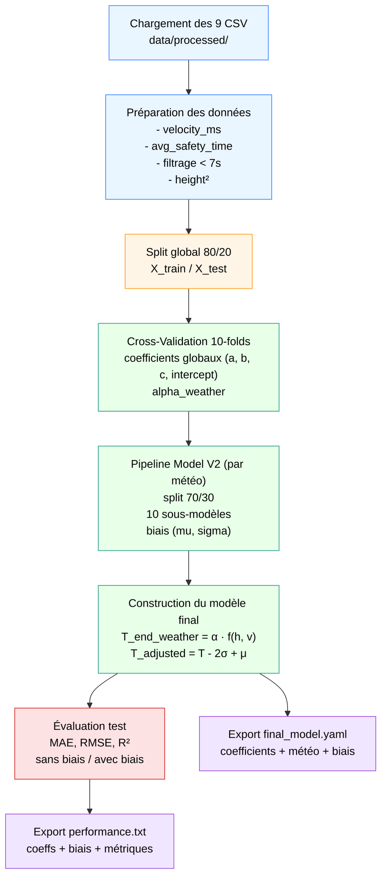

# 📁 `model_training/` — README

## 🎯 Objectif du dossier

Le dossier **`model_training/`** contient l’ensemble des outils nécessaires pour :

1. **entraîner le modèle analytique de prédiction du temps minimal de non-traversée** (Expérience 2),
2. générer les **coefficients globaux**, les **coefficients météo** (`alpha_weather`) et les **biais comportementaux** (µ, σ),
3. évaluer le modèle sur un jeu de test indépendant,
4. exporter le modèle final en YAML pour son intégration dans des scripts externes,
5. produire un rapport texte documentant les performances et les paramètres.

Ce dossier correspond à la **version reproductible et industrialisée** du notebook `model.ipynb`.

Pipeline :


---

## 📦 Structure du dossier

```
model_training/
 ├── model.ipynb               # Version interactive : exploration + figures + analyses
 ├── train.py                  # Script d'entraînement reproductible
 ├── logs/
 │    └── performance.txt      # Rapport final des performances du 

```
# 🧠 Description des fichiers


## 📘 `model.ipynb` — Notebook d'exploration et d'entraînement

Notebook accessible ici : 

[](https://sandravict0r.github.io/pedestrian-crossing-prediction/lab/index.html?path=model.ipynb)

Le notebook reprend l’ensemble du pipeline scientifique :

### **🔍 Exploration & préparation**

* chargement des 9 CSV météo × vitesse,
* concaténation, ajout de la colonne `weather`,
* calcul : `velocity_ms`, `avg_safety_time`,
* filtrage `avg_safety_time < 7` pour stabiliser le modèle.

### **🧩 Construction des features**

* `height`
* `height²`
* `velocity_exp2`

(possibilité d’ajouter d'autres polynômes pour l'analyse scientifique)

### **🏋️ Modèle global**

* régression linéaire sur 80% du dataset,
* cross-validation 10 folds → coefficients (a, b, c, intercept),
* estimation des coefficients météo : `alpha_clear`, `alpha_rain`, `alpha_night`.

### **🧠 Modèle V2 (biais comportemental)**

Pour chaque météo :

* fit du modèle,
* calcul des biais :

  * μ = erreur moyenne
  * σ = écart-type des erreurs
* construction du modèle final :

$$
T_{\text{end}}=\alpha_{\text{weather}}\left(
    a \cdot h + b \cdot h^{2} + c \cdot v + \text{intercept}\right)- 2\sigma_{\text{weather}}+ \mu_{\text{weather}}
  $$


* ( $\alpha_{\text{weather}}$) = correction systématique liée à la météo
* ($ a, b, c$ ) = coefficients globaux du modèle linéaire
* ( $h$ ) = hauteur du participant
* ( $v$ ) = vitesse du véhicule
* ( $\mu_{\text{weather}} $) = biais moyen (mean error)
* ($ \sigma_{\text{weather}}$ ) = variabilité des erreurs (écart-type)

Et le terme :

$$
-2\sigma_{\text{weather}} + \mu_{\text{weather}}
$$

introduit une **marge de sécurité conservatrice**.


### **📉 Évaluation**

* prédictions "no bias" vs prédictions finales,
* calcul MAE, RMSE, R², ME, STD,
* visualisations : scatter, résidus, météo × prédiction.

### **💾 Export**

* sauvegarde du modèle dans `saved_models/final_model.yaml`.

👉 **Usage :** documentation scientifique + figures de la thèse + justification du modèle.

---

## 🏋️ `train.py` — Script d’entraînement automatisé

Version “production" entièrement reproductible du notebook.

Lancer simplement :

```bash
cd model/model_training/
python train.py
```

Le script effectue automatiquement :

### **1. Chargement**

* lecture de tous les CSV,
* extraction météo depuis le nom de fichier,
* ajout : `velocity_ms`, `avg_safety_time`.

### **2. Préparation**

* ajout de la feature `height²`,
* filtrage `avg_safety_time < 7`,
* construction de X, y, weather.

### **3. Split global**

80% train / 20% test.

### **4. Cross-validation 10 folds**

→ estimation moyenne :

* coefficients globaux (a, b, c, intercept)
* coefficients météo `alpha_weather`

### **5. Pipeline V2 (biais comportemental)**

Pour chaque météo :

* split 70/30,
* moyenne sur 10 sous-modèles,
* extraction des biais (μ, σ).

### **6. Évaluation complète**

Sur le jeu de test :

* **sans biais**
* **avec biais** (modèle final conservateur)

Métriques calculées :

* MAE
* RMSE
* R²
* ME
* STD

### **7. Export modèle final**

→ `saved_models/final_model.yaml`

Contient :

* coefficients globaux
* paramètres météo
* biais comportementaux
* métriques du test set

### **8. Export rapport texte**

→ `logs/performance.txt`

---

## 📄 `logs/performance.txt` — Rapport d’entraînement

Le fichier contient un résumé complet du modèle appris.
Voici un **exemple réel** généré le 26/11/2025 :

### **🔢 Coefficients globaux (moyenne CV)**

```
height       : -1.3614
height^2     : 0.0039
velocity_exp2: -0.0540
intercept    : 126.0592
```

### **🌦️ Coefficients météo**

```
clear : 1.0385
night : 1.0008
rain  : 0.9681
```

### **🧠 Biais comportementaux (Model V2)**

```
clear : mu=0.0386, sigma=1.0008
rain  : mu=0.0006, sigma=0.7211
night : mu=0.0007, sigma=0.9393
```

### **📊 Performances — Sans biais**

```
MAE   : 0.7310
RMSE  : 0.9489
R2    : 0.4789
ME    : -0.0089
STD   : 0.9488
```

### **📊 Performances — Modèle final avec biais (Version conservatrice)**

```
MAE   : 1.7770
RMSE  : 2.0052
R2    : -1.3273
ME    : 1.7374
STD   : 1.0012
```

ℹ️ Le modèle **avec biais** n’a pas pour objectif d’optimiser les métriques classiques :
il est volontairement **prudent** et **sécuritaire** (prévoit moins longtemps la possibilité de traverser).

---

# 🔧 Paramètres d’entraînement

| Paramètre             | Valeur | Rôle                |
| --------------------- | ------ | ------------------- |
| `SAFETY_TIME_LIMIT`   | 7.0 s  | filtrage outliers   |
| `TEST_SIZE_GLOBAL`    | 0.20   | split global 80/20  |
| `N_SPLITS_CV`         | 10     | cross-validation    |
| `V2_TEST_SIZE_MAIN`   | 0.30   | split météo interne |
| `V2_N_ITER`           | 10     | moyennes V2         |
| `RANDOM_STATE_GLOBAL` | 42     | reproductibilité    |

---

# 🔄 Pipeline d’utilisation

## **1. Vérifier l’emplacement des données**

Les 9 fichiers doivent être dans :

```
data/processed/
```

## **2. Lancer l'entraînement**

```bash
python train.py
```

## **3. Résultats produits**

```
model/
 ├── saved_models/
 │     └── final_model.yaml
 └── model_training/
       └── logs/performance.txt
```

---

# 📌 Notes importantes

* Ce dossier **ne modifie jamais les données** (lecture seule).
* Le script `train.py` assure la **reproductibilité totale** du pipeline.
* Le modèle final est **interprétable**, compact et utilisable dans les environnements AV/VR.
* Le notebook reste la référence pour les **figures, explorations et explications scientifiques**.
* Le YAML exporté est compatible avec un usage direct dans un module Python externe (`CNRS_behavior_model.py`).

